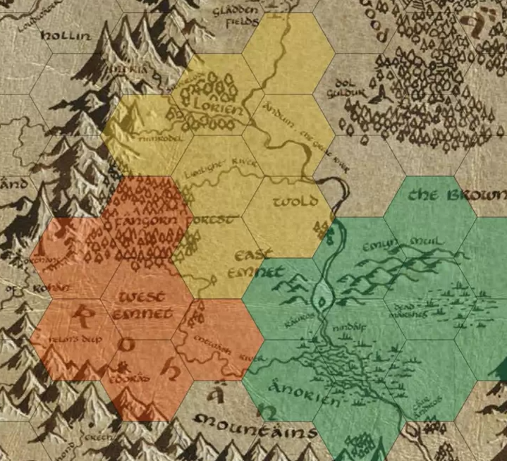

# Political Map Overlay

A module which allows the GM to color hexes/squares according to who owns the territory.

### Usage

Click on the "Political Map Overlay" (hand-shake) scene controls, select a color, and draw.

Right-click can be used to erase single tiles without switching to the Eraser tool.

### Acknowledgements

Inspired by, and based on, [Simplefog](https://foundryvtt.com/packages/polmap). The two can be used in tandem!
